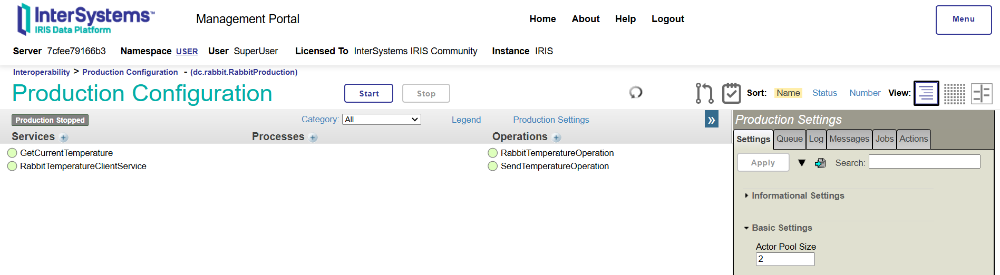
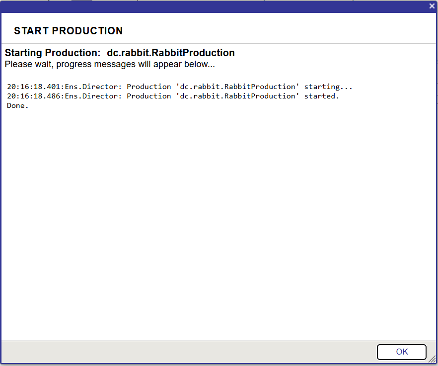

 [](https://openexchange.intersystems.com/package/rabbit-iris-sample)

# rabbit-iris-sample
This is a sample about using IRIS Interoperability and RabbitMQ to produce and consume messages in real-time.
It contains a simple interoperablity production which reads the current temperature from lat/long coordinates and publish to a RabbitMQ topic. The production consume the topic and save the current temperature into the IRIS database. 

## Installation: ZPM

Open IRIS Namespace with Interoperability Enabled.
Open Terminal and call:
USER>zpm "rabbit-iris-sample"

## Installation: Docker
Clone/git pull the repo into any local directory

```
$ git clone https://github.com/yurimarx/rabbit-iris-sample.git
```

Open the terminal in this directory and run:

```
$ docker-compose build
```

3. Run the IRIS container with your project:

```
$ docker-compose up -d
```

## Configure the RabbitMQ

1. Go to [RabbitMQ console](http://localhost:15672/) and login with Username guest and Password guest to see the initial page:

2. Go to tab Exchange > Section Add a new exchange > set temperature value for Name field and select the option Topic on the field Type and click Add exchange:

3. Go to tab Queues and Streams > Section Add a new queue > set temperature value for Name field and click Add queue:

4. In the tab Queues and Streams > click on the temperature queue:

5. Go to the section Add binding to this queue > set temperature value for From exchange field, set temperature.current to Routing key field and click the button Bind:

6. Now que queue and the exchange are connected and ready to manage messages with the routing key temperature.current:


## Start the production and see the results
1. Go to the [sample production](http://localhost:52795/csp/user/EnsPortal.ProductionConfig.zen?PRODUCTION=dc.rabbit.RabbitProduction) and click the button Start:

2. The production starts with success:

3. Now go to the [SQL](http://localhost:52795/csp/sys/exp/%25CSP.UI.Portal.SQL.Home.zen?$NAMESPACE=USER&$NAMESPACE=USER) to query the temperature table to see the results:

4. Check the production business services, business operations and the messages produced to see how the samples works. Enjoy!